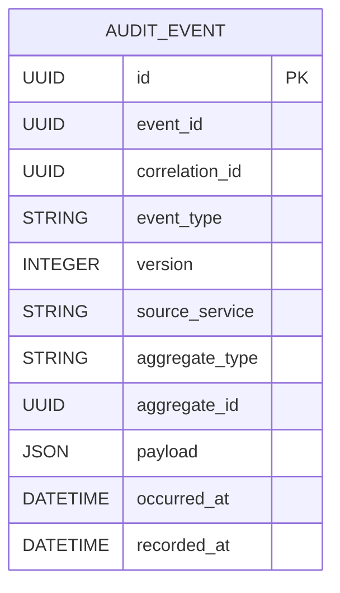

# 📋 Audit Service

<a id="indice"></a>

# 📑 Índice

1. [📝 Visão Geral](#visao-geral)
   - 1.1 [🎯 Objetivo](#objetivo)
   - 1.2 [📌 Responsabilidades](#responsabilidades)
   - 1.3 [🚫 Fora do escopo](#fora-do-escopo)
2. [🗄️ Modelo de dados](#modelo-de-dados)
   - 2.1 [📖 Visão geral](#modelo-visao-geral)
   - 2.2 [📊 Modelo conceitual](#modelo-conceitual)
   - 2.3 [🏛️ Entidades](#entidades)
      - 2.3.1 [📋 AuditEvent](#audit-event)
   - 2.4 [📐 Regras de modelagem](#regras-de-modelagem)
3. [📦 Modelos de requisição e resposta (DTOs)](#dtos)
   - 3.1 [📥 Modelos de resposta](#response-dtos)
      - 3.1.1 [AuditEventResponse](#audit-event-response)
      - 3.1.2 [AuditEventSummaryResponse](#audit-event-summary-response)
      - 3.1.3 [Page<AuditEventSummaryResponse>](#page-audit-event-summary-response)
4. [📋 Eventos de auditoria](#eventos-de-auditoria)
   - 4.1 [📋 Listar eventos](#listar-eventos)
   - 4.2 [🔍 Buscar evento](#buscar-evento)

---

<a id="visao-geral"></a>
# 📝 Visão geral

<a id="objetivo"></a>
## 🎯 Objetivo

O Audit Service é o microsserviço responsável por disponibilizar a consulta dos eventos de auditoria registrados na plataforma.

Os eventos são criados exclusivamente pelo consumo de eventos publicados pelos demais microsserviços e armazenados de forma imutável.

⬆️ [Voltar ao índice](#indice)

<a id="responsabilidades"></a>
## 📌 Responsabilidades

O Audit Service é responsável por:

- Disponibilizar o histórico de auditoria da plataforma.
- Consultar eventos de auditoria.
- Listar eventos de forma paginada.
- Permitir a filtragem de eventos por diferentes critérios.
- Preservar a rastreabilidade dos eventos registrados.

⬆️ [Voltar ao índice](#indice)

---

<a id="fora-do-escopo"></a>
## 🚫 Fora do escopo

O Audit Service não é responsável por:

- Criar eventos de auditoria por meio da API.
- Alterar registros de auditoria.
- Excluir registros de auditoria.
- Executar regras de negócio dos demais microsserviços.
- Publicar eventos.

⬆️ [Voltar ao índice](#indice)

<a id="modelo-de-dados"></a>
# 🗄️ Modelo de dados

<a id="modelo-visao-geral"></a>
## 📖 Visão geral

O modelo de dados do Audit Service é composto por uma única entidade responsável pelo armazenamento dos eventos de auditoria registrados na plataforma.

Cada registro representa um evento consumido do barramento de mensagens e preserva integralmente suas informações para fins de rastreabilidade, auditoria e consulta.

⬆️ [Voltar ao índice](#indice)

<a id="modelo-conceitual"></a>
## 📊 Modelo conceitual

O modelo conceitual representa a estrutura da entidade utilizada pelo Audit Service para armazenar os eventos de auditoria da plataforma.

Cada evento registrado corresponde a uma mensagem consumida do barramento de eventos e permanece armazenado de forma imutável.

O diagrama abaixo representa a entidade utilizada pelo Audit Service para armazenar os eventos de auditoria da plataforma.


A API disponibiliza apenas operações de consulta, não sendo possível criar, alterar ou remover eventos de auditoria por meio de requisições HTTP.

⬆️ [Voltar ao índice](#indice)

<a id="entidades"></a>
## 🏛️ Entidades

O modelo de dados do Audit Service é composto por uma única entidade.

---

<a id="audit-event"></a>
### 📋 AuditEvent

Representa um evento de auditoria persistido pelo Audit Service após o consumo de uma mensagem do barramento de eventos.

#### Responsabilidades

- Armazenar as informações do evento recebido.
- Preservar o payload original do evento.
- Permitir consultas e rastreabilidade dos eventos registrados.
- Manter o histórico de auditoria de forma imutável.

#### Atributos

| Campo | Tipo | Descrição |
|--------|------|-----------|
| `id` | UUID | Identificador do registro de auditoria. |
| `eventId` | UUID | Identificador único do evento publicado. |
| `correlationId` | UUID | Identificador utilizado para correlacionar eventos pertencentes ao mesmo fluxo de negócio. |
| `eventType` | String | Tipo do evento registrado. |
| `version` | Integer | Versão do contrato do evento. |
| `sourceService` | String | Microsserviço responsável pela publicação do evento. |
| `aggregateType` | String | Tipo do agregado relacionado ao evento. |
| `aggregateId` | UUID | Identificador do agregado relacionado ao evento. |
| `payload` | JSON | Conteúdo original do evento. |
| `occurredAt` | Instant | Data e hora em que o evento ocorreu. |
| `recordedAt` | Instant | Data e hora em que o evento foi persistido. |

⬆️ [Voltar ao índice](#indice)

---

<a id="regras-de-modelagem"></a>
## 📐 Regras de modelagem

- Cada registro representa um único evento consumido pelo Audit Service.
- Os registros de auditoria são imutáveis após a persistência.
- O payload é armazenado integralmente, preservando a estrutura original do evento recebido.
- O identificador `id` representa o registro persistido, enquanto `eventId` identifica o evento publicado.
- O `correlationId` permite correlacionar eventos pertencentes ao mesmo fluxo de negócio.
- Os campos `occurredAt` e `recordedAt` registram, respectivamente, o momento da ocorrência e da persistência do evento.

⬆️ [Voltar ao índice](#indice)

<a id="dtos"></a>
# 📦 Modelos de requisição e resposta (DTOs)

Esta seção descreve os modelos de resposta utilizados pelos endpoints da API.

## 📥 Modelos de resposta (Response DTOs)

<a id="audit-event-response"></a>
### AuditEventResponse

Utilizado para retornar os dados completos de um evento de auditoria.

| Campo | Tipo | Descrição |
|--------|------|-----------|
| `id` | UUID | Identificador do registro de auditoria. |
| `eventId` | UUID | Identificador do evento publicado. |
| `correlationId` | UUID | Identificador utilizado para correlacionar eventos pertencentes ao mesmo fluxo de negócio. |
| `eventType` | String | Tipo do evento registrado. |
| `version` | Integer | Versão do contrato do evento. |
| `sourceService` | String | Microsserviço responsável pela publicação do evento. |
| `aggregateType` | String | Tipo do agregado relacionado ao evento. |
| `aggregateId` | UUID | Identificador do agregado relacionado ao evento. |
| `payload` | Object | Conteúdo original do evento. |
| `occurredAt` | Instant | Data e hora em que o evento ocorreu. |
| `recordedAt` | Instant | Data e hora em que o evento foi persistido. |

#### Exemplo

```json
{
  "id": "<audit_event_uuid>",
  "eventId": "<event_uuid>",
  "correlationId": "<correlation_uuid>",
  "eventType": "<event_type>",
  "version": 1,
  "sourceService": "<source_service>",
  "aggregateType": "<aggregate_type>",
  "aggregateId": "<aggregate_uuid>",
  "payload": {
    "...": "..."
  },
  "occurredAt": "<occurred_at>",
  "recordedAt": "<recorded_at>"
}
```

⬆️ [Voltar ao índice](#indice)

---

<a id="audit-event-summary-response"></a>
### AuditEventSummaryResponse

Utilizado para retornar os dados resumidos de um evento de auditoria nas operações de listagem.

| Campo | Tipo | Descrição |
|--------|------|-----------|
| `id` | UUID | Identificador do registro de auditoria. |
| `eventId` | UUID | Identificador do evento publicado. |
| `correlationId` | UUID | Identificador utilizado para correlacionar eventos pertencentes ao mesmo fluxo de negócio. |
| `eventType` | String | Tipo do evento registrado. |
| `version` | Integer | Versão do contrato do evento. |
| `sourceService` | String | Microsserviço responsável pela publicação do evento. |
| `aggregateType` | String | Tipo do agregado relacionado ao evento. |
| `aggregateId` | UUID | Identificador do agregado relacionado ao evento. |
| `occurredAt` | Instant | Data e hora em que o evento ocorreu. |
| `recordedAt` | Instant | Data e hora em que o evento foi persistido. |

#### Exemplo

```json
{
  "id": "<audit_event_uuid>",
  "eventId": "<event_uuid>",
  "correlationId": "<correlation_uuid>",
  "eventType": "<event_type>",
  "version": 1,
  "sourceService": "<source_service>",
  "aggregateType": "<aggregate_type>",
  "aggregateId": "<aggregate_uuid>",
  "occurredAt": "<occurred_at>",
  "recordedAt": "<recorded_at>"
}
```

⬆️ [Voltar ao índice](#indice)

---

<a id="page-audit-event-summary-response"></a>
### Page<AuditEventSummaryResponse>

Utilizado para retornar uma lista paginada de eventos de auditoria.

| Campo | Tipo | Descrição |
|--------|------|-----------|
| `content` | List\<AuditEventSummaryResponse> | Lista de eventos de auditoria. |
| `page` | Integer | Número da página atual. |
| `size` | Integer | Quantidade de registros por página. |
| `totalElements` | Long | Quantidade total de registros. |
| `totalPages` | Integer | Quantidade total de páginas. |

#### Exemplo

```json
{
  "content": [
    {
      "id": "<audit_event_uuid>",
      "eventId": "<event_uuid>",
      "correlationId": "<correlation_uuid>",
      "eventType": "<event_type>",
      "version": 1,
      "sourceService": "<source_service>",
      "aggregateType": "<aggregate_type>",
      "aggregateId": "<aggregate_uuid>",
      "occurredAt": "<occurred_at>",
      "recordedAt": "<recorded_at>"
    }
  ],
  "page": 0,
  "size": 10,
  "totalElements": "<total_elements>",
  "totalPages": "<total_pages>"
}
```

⬆️ [Voltar ao índice](#indice)

<a id="eventos-de-auditoria"></a>
# 📋 Eventos de auditoria

Esta seção documenta os endpoints responsáveis pela consulta dos eventos de auditoria registrados na plataforma.

---

<a id="listar-eventos"></a>
## 📋 Listar Eventos

### Objetivo

Listar os eventos de auditoria de forma paginada.

### Endpoint

```http
GET /api/v1/audit-events
```

### Autenticação

Obrigatória (`Bearer Token`).

### Cabeçalhos

| Nome | Obrigatório | Valor |
|------|:-----------:|-------|
| `Authorization` | Sim | `Bearer <access_token>` |

### Parâmetros de Consulta

| Nome | Tipo | Obrigatório | Padrão | Descrição |
|------|------|:-----------:|--------|-----------|
| `page` | Integer | Não | `0` | Número da página. |
| `size` | Integer | Não | `10` | Quantidade de registros por página. |
| `sort` | String | Não | `recordedAt,desc` | Campo e direção da ordenação. |
| `eventType` | String | Não | — | Filtra pelo tipo do evento. |
| `aggregateType` | String | Não | — | Filtra pelo tipo do agregado. |
| `aggregateId` | UUID | Não | — | Filtra pelo identificador do agregado. |
| `sourceService` | String | Não | — | Filtra pelo microsserviço de origem. |
| `correlationId` | UUID | Não | — | Filtra pelo identificador de correlação. |
| `occurredAfter` | Instant | Não | — | Retorna eventos ocorridos após a data informada. |
| `occurredBefore` | Instant | Não | — | Retorna eventos ocorridos antes da data informada. |

### Resposta de Sucesso

DTO: `Page<AuditEventSummaryResponse>`

#### Exemplo

```json
{
  "content": [
    {
      "id": "<audit_event_uuid>",
      "eventId": "<event_uuid>",
      "correlationId": "<correlation_uuid>",
      "eventType": "<event_type>",
      "version": 1,
      "sourceService": "<source_service>",
      "aggregateType": "<aggregate_type>",
      "aggregateId": "<aggregate_uuid>",
      "occurredAt": "<occurred_at>",
      "recordedAt": "<recorded_at>"
    }
  ],
  "page": 0,
  "size": 10,
  "totalElements": "<total_elements>",
  "totalPages": "<total_pages>"
}
```

### Regras de Negócio

- Apenas eventos persistidos são retornados.
- O payload do evento não é retornado na listagem.
- A listagem é paginada utilizando Spring Data.
- É possível combinar múltiplos filtros na mesma consulta.

### Códigos HTTP

| Código | Descrição |
|---------|-----------|
| `200 OK` | Consulta realizada com sucesso. |
| `400 Bad Request` | Parâmetros inválidos. |
| `401 Unauthorized` | Usuário não autenticado. |
| `403 Forbidden` | Usuário sem permissão. |
| `500 Internal Server Error` | Erro interno do servidor. |

⬆️ [Voltar ao índice](#indice)

---

<a id="buscar-evento"></a>
## 🔍 Buscar Evento

### Objetivo

Consultar um evento de auditoria pelo identificador.

### Endpoint

```http
GET /api/v1/audit-events/{id}
```

### Autenticação

Obrigatória (`Bearer Token`).

### Cabeçalhos

| Nome | Obrigatório | Valor |
|------|:-----------:|-------|
| `Authorization` | Sim | `Bearer <access_token>` |

### Parâmetros de Caminho

| Nome | Tipo | Obrigatório | Descrição |
|------|------|:-----------:|-----------|
| `id` | UUID | Sim | Identificador do registro de auditoria. |

### Resposta de Sucesso

DTO: `AuditEventResponse`

#### Exemplo

```json
{
  "id": "<audit_event_uuid>",
  "eventId": "<event_uuid>",
  "correlationId": "<correlation_uuid>",
  "eventType": "<event_type>",
  "version": 1,
  "sourceService": "<source_service>",
  "aggregateType": "<aggregate_type>",
  "aggregateId": "<aggregate_uuid>",
  "payload": {
    "...": "..."
  },
  "occurredAt": "<occurred_at>",
  "recordedAt": "<recorded_at>"
}
```

### Regras de Negócio

- Apenas eventos persistidos podem ser consultados.
- O payload retornado corresponde exatamente ao evento recebido.
- O conteúdo do payload não é modificado pelo Audit Service.
- O evento deve existir.

### Códigos HTTP

| Código | Descrição |
|---------|-----------|
| `200 OK` | Evento encontrado. |
| `401 Unauthorized` | Usuário não autenticado. |
| `403 Forbidden` | Usuário sem permissão. |
| `404 Not Found` | Evento não encontrado. |
| `500 Internal Server Error` | Erro interno do servidor. |

⬆️ [Voltar ao índice](#indice)
